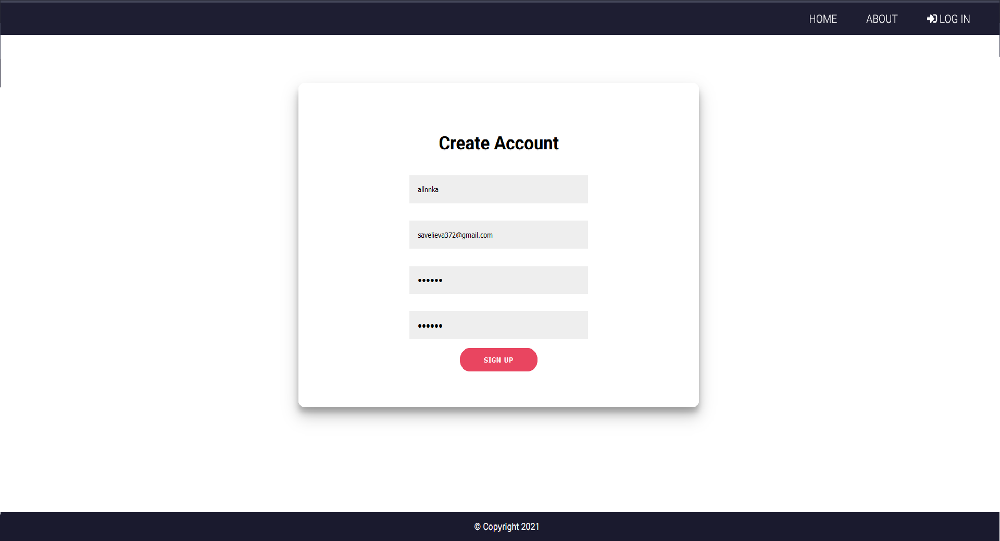
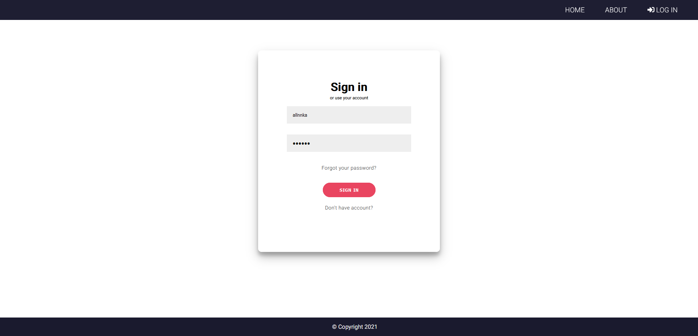
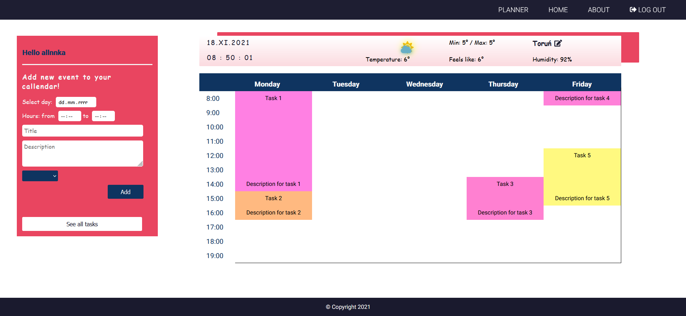
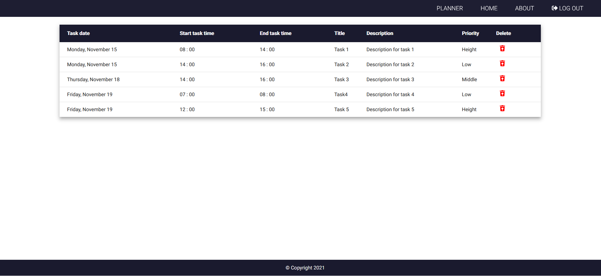

# Planner

Technologies:
- Spring Boot
- Spring Security
- Hibernate
- PostgreSQL
- Angular

Program for planning, with options:
- User registration
- User Login
- Adding task
- Visualization of planner
- Getting current weather from openweathermap

